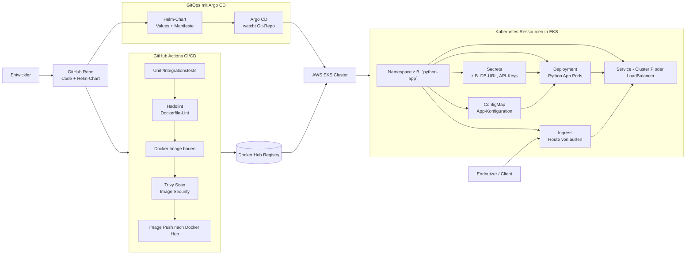

# Python App

Einfache Flask-API mit zwei Endpunkten (`/api/v1/details` und `/api/v1/healthz`), die Hostname und Zeit zurückliefert. Unten findest du kurze Schritte für lokalen Start, Docker-Image, Kubernetes-Deployment und die CI/CD- & GitOps-Architektur.

## Voraussetzungen
- Python 3.10+ (Dockerfile nutzt 3.14-alpine)
- pip
- (Optional) Docker & Kubernetes-Cluster (z. B. kind, k3d, Minikube)

## Lokal ausführen
```bash
python -m venv .venv
source .venv/bin/activate  # Windows: .venv\Scripts\activate
pip install -r requirements.txt
python src/app.py
```
Die API läuft auf `http://localhost:5000`.

Nützliche Calls:
- `curl http://localhost:5000/api/v1/healthz`
- `curl http://localhost:5000/api/v1/details`

## Tests
Tests werden mit `pytest` im Ordner `tests/` ausgeführt.

### Lokal ausführen
```bash
python -m venv .venv
source .venv/bin/activate  # Windows: .venv\Scripts\activate
pip install -r requirements.txt
pytest
```

Die GitHub Action (`.github/workflows/cicd.yaml`) führt bei jedem Push/PR auf `main`:
- `pytest` aus und bricht den Build bei fehlschlagenden Tests ab.
- eine Analyse des `Dockerfile` mit **Hadolint** durch; bei Verstößen schlägt die CI-Pipeline fehl.
- einen lokalen Build des Docker-Images und einen Security-Scan mit **Trivy** durch. Nur wenn keine Schwachstellen mit Schweregrad `HIGH` oder `CRITICAL` gefunden werden, wird das Image anschließend in Docker Hub gepusht.

## Docker
Image bauen und lokal testen:
```bash
docker build -t python-app:local .
docker run -p 5000:5000 python-app:local
```

## Kubernetes (manifeste)
Im Ordner `k8s/` liegen Deployment, Service und Ingress.
```bash
kubectl apply -f k8s/deployment.yml
kubectl apply -f k8s/service.yml
kubectl apply -f k8s/ingress.yml
```
Standardmäßig lauscht das Deployment auf Port 5000, Service auf 80, Ingress auf Host `localhost`.

## Helm Chart
Ein Chart liegt unter `charts/python-app/`. Beispiel-Installation (Namespace optional anpassen):
```bash
helm upgrade --install python-app charts/python-app/ -n python-app --create-namespace
```
Werte können über `values.yaml` oder `--set` überschrieben werden.

## Architektur- und Pipeline-Übersicht

### Gesamtarchitektur (Anwendung, CI/CD, GitOps)



### Kurzbeschreibung

Die Plattform besteht aus einer Python-Anwendung, die als Container in einem AWS‑EKS‑Cluster betrieben wird. Der Quellcode sowie das zugehörige Helm‑Chart liegen in einem GitHub‑Repository, auf das ein GitHub‑Actions‑Workflow reagiert. Im CI‑Prozess werden automatisierte Tests ausgeführt, das Dockerfile mit Hadolint geprüft, ein Docker‑Image gebaut und mit Trivy auf Sicherheitslücken gescannt; bei Erfolg wird das Image in ein Docker‑Hub‑Registry‑Repository gepusht.  
Die Auslieferung nach Kubernetes erfolgt GitOps‑basiert über Argo CD, das kontinuierlich den gewünschten Zustand aus dem Git‑Repository liest und per Helm‑Release im EKS‑Cluster ausrollt. Innerhalb des Clusters wird die Anwendung in einem dedizierten Namespace betrieben, nutzt ConfigMaps und Secrets für Konfiguration und sensible Daten, wird über ein Deployment skaliert, über einen Service exponiert und durch ein Ingress‑Objekt für externe Nutzer erreichbar gemacht.

## Endpunkte
- `GET /api/v1/healthz` – Healthcheck
- `GET /api/v1/details` – Message, Hostname, Zeitstempel